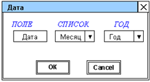

ВИП-408 Раенко Тимофей

Вариант 5

Создать всплывающее окно с элементами для ввода информации (согласно варианту задания) и кнопками ОК и Cancel. При нажатии на кнопку Ok вводимый текст передается на страницу. При нажатии на кнопку cancel диалоговое окно закрывается. диалоговое с помощью
библиотеки jQueryUI.

Написать программу, обрабатывающую события созданного окна (аналогично примеру, предсталенному в раделе «Отображение формы в модальном диалоговом окне»).

